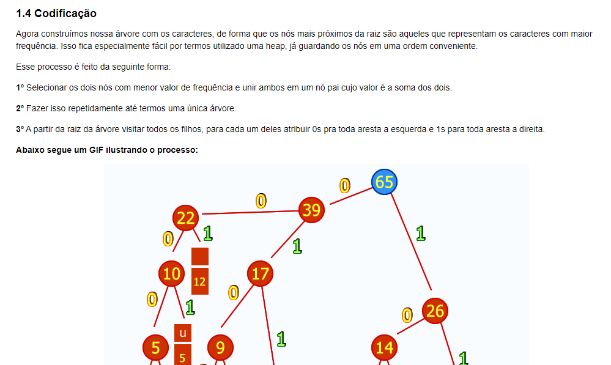
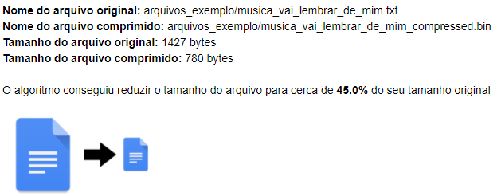

# Greed_InteractiveTutorial

**Número da Lista**: 3 
**Conteúdo da Disciplina**: Greed 

## Alunos
|Matrícula | Aluno |
| -- | -- |
| 17/0017885  |  Marcos Nery Borges Júnior |

## Sobre 
Esse projeto consiste em um notebook interativo que permite ao usuário comprimir e descomprimir um arquivo de texto ao mesmo tempo que aprende cada passo do algoritmo de huffman.

## Screenshots
#### Screenshot 1

#### Screenshot 2

## Instalação 
**Linguagem**: Python >= 3.8 
**Framework**: Jupyter Notebook 

O projeto foi feito através do Jupyter notebook, que reune em um só lugar todo o código e a explicação de cada uma das etapas. 

Se desejar apenas visualizar o jupyter notebook, com um exemplo de execução feita, basta ver o arquivo [huffman_main.ipyn](https://github.com/projeto-de-algoritmos/Greed_HuffmanFileCompress/blob/master/huffman_main.ipynb) pelo próprio GitHub.

Para executar/visualizar o notebook em seu computador basta instalar o jupyter notebook através das instruções dispostas na seção "Getting started with the classic Jupyter Notebook" [aqui](https://jupyter.org/install). Se preferir, você também poderá utilizar o docker (opção mais fácil), seguindo as instruções mais abaixo.

## Instalação com Docker

Se você tiver docker na sua máquina tudo fica mais fácil. Basta executar o comando `docker-compose up` e o ambiente estará em funcionamento.
  
  * Para acessar o jupyter notebook basta ir até http://localhost:8888/ (o token de autenticação é exposto no terminal ao rodar o comando descrito)
  
  
 ## Instruções de execução
 
 Basta seguir o notebook executando cada uma das células. Você pode executar uma célula pelo menu no topo do notebook ou apertando Ctrl + Enter com a célula selecionada.
 Instruções adicionais podem ser encontradas no vídeo.

